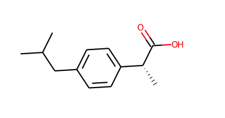
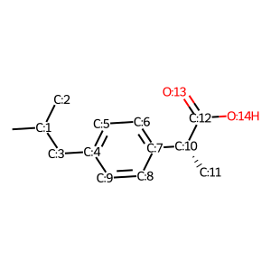

The whole world is made up of molecules, you are made of molecules! To use molecules inside computer programs and especially neural networks, we need to be able to digitize them. Here I am going to show how molecules are represented inside the computer.

### SMILES Strings

SMILE strings are very straightforward. They are always available on Wikipedia. For example, if you wanted to depict **Ibuprofen** as a SMILE string you can simply go to the Wikipedia page and look for SMILES inside the right table.



`CC(C)Cc1ccc(cc1)[C@@H](C)C(=O)O`

### Graph as an adjacency matrix

Another way to digitalize molecules is to represent them as graphs. a graph that is not sparse can be represented using adjacency in a very efficient way.

Each atom is assigned a number starting from `0`.
Then the connection between two atoms is shown by an adjacency matrix like the one below. Where index `i, j` of the matrix is `0` when there is no bond between the atoms i and j and `1` if there is a bond.



```
[
    [0, 1, 0, 0, 0, 0, 0, 0, 0, 0, 0, 0, 0, 0, 0],
    [1, 0, 1, 1, 0, 0, 0, 0, 0, 0, 0, 0, 0, 0, 0],
    [0, 1, 0, 0, 0, 0, 0, 0, 0, 0, 0, 0, 0, 0, 0],
    [0, 1, 0, 0, 1, 0, 0, 0, 0, 0, 0, 0, 0, 0, 0],
    [0, 0, 0, 1, 0, 1, 0, 0, 0, 1, 0, 0, 0, 0, 0],
    [0, 0, 0, 0, 1, 0, 1, 0, 0, 0, 0, 0, 0, 0, 0],
    [0, 0, 0, 0, 0, 1, 0, 1, 0, 0, 0, 0, 0, 0, 0],
    [0, 0, 0, 0, 0, 0, 1, 0, 1, 0, 1, 0, 0, 0, 0],
    [0, 0, 0, 0, 0, 0, 0, 1, 0, 1, 0, 0, 0, 0, 0],
    [0, 0, 0, 0, 1, 0, 0, 0, 1, 0, 0, 0, 0, 0, 0],
    [0, 0, 0, 0, 0, 0, 0, 1, 0, 0, 0, 1, 1, 0, 0],
    [0, 0, 0, 0, 0, 0, 0, 0, 0, 0, 1, 0, 0, 0, 0],
    [0, 0, 0, 0, 0, 0, 0, 0, 0, 0, 1, 0, 0, 1, 1],
    [0, 0, 0, 0, 0, 0, 0, 0, 0, 0, 0, 0, 1, 0, 0],
    [0, 0, 0, 0, 0, 0, 0, 0, 0, 0, 0, 0, 1, 0, 0]
]
```

### Graph as an adjacency list

As you saw above, an adjacency matrix is not a good representation because most of the members are `0`. This is called a sparse matrix. A better way to represent a sparse adjacency matrix is using adjacency lists.

For example, the above matrix can be represented using a single array.


```
[[0, 1], [1, 2], [1, 3], [3, 4], [4, 5], [5, 6], [6, 7], [7, 8], [8, 9], [7, 10], [10, 11], [10, 12], [12, 13], [12, 14], [9, 4]]
```

This list is a list of bonds. Each member shows a bond between two atoms. For example, the first member `[0, 1]` shows there is a connection between the `0`th and `1`st atom. As you can see in the above image that is indeed true.

The main problem with the Graph representations is that the information indicating the kind of the bond (Single, Double, etc.) is lost.

Later we will show how to avoid losing that information.