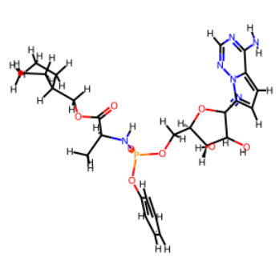
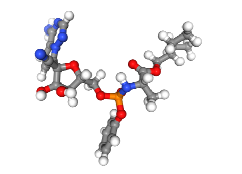

Recently, I have been experimenting with a Graph Neural Network (GNN) and have attempted to train it on the [FS-MOL dataset](https://github.com/microsoft/FS-Mol). However, I have used some additional preprocessing steps that were not included in the original FSMOL dataset.

It is crucial for neural network researchers to visualize the exact input that goes **in** the neural network. This ensures that the input data is correct and there are no errors in the preprocessing steps that may result in faulty data.

To depict a molecule, one common method is to use SMILES strings. First, we need to install the necessary libraries by running:


```
pip install rdkit ipywidgets nglview
```


To create a 3D depiction of a molecule, we can either download a preexisting 3D depiction of a molecule from sources like PubChem or use RDKit's built-in module to calculate 3D coordinates of atoms in a molecule represented in the SMILES format.

Regardless of the method used, we require the `nglview` library to view 3D depictions of molecules in Jupyter Notebooks.

To demonstrate, let's use RDKit to calculate the 3D coordinates of [Remdesivir](https://en.wikipedia.org/wiki/Remdesivir). The SMILES string for Remdesivir can be obtained from Wikipedia.

```
from rdkit import Chem
from rdkit.Chem import Draw, rdDepictor, AllChem
from rdkit.Geometry import Point2D
from IPython.display import display
import nglview as nv

smiles = 'CCC(COC(=O)[C@@H](NP(=O)(Oc1ccccc1)OC[C@H]1O[C@@]([C@@H]([C@@H]1O)O)(C#N)c1ccc2n1ncnc2N)C)CC' # The smiles string representing Remdesivir


mol = Chem.MolFromSmiles(smiles)
mol = Chem.AddHs(mol)
AllChem.EmbedMolecule(mol)
AllChem.MMFFOptimizeMolecule(mol) # Using the MMFFOptimization should result in a more accurate depiction


img = Draw.MolToImage(mol)

img.show()
```


The resulting image will be a 2D structure, as the `Draw` module can only depict 2D structures. However, we can improve this by creating an interactive 3D depiction of Remdesivir in Jupyter Notebooks by running:


```
view = nv.show_rdkit(mol)

view
```


The resulting _ipywidget_ is an interactable 3D depiction of Remdesivir in Jupyter notebooks.